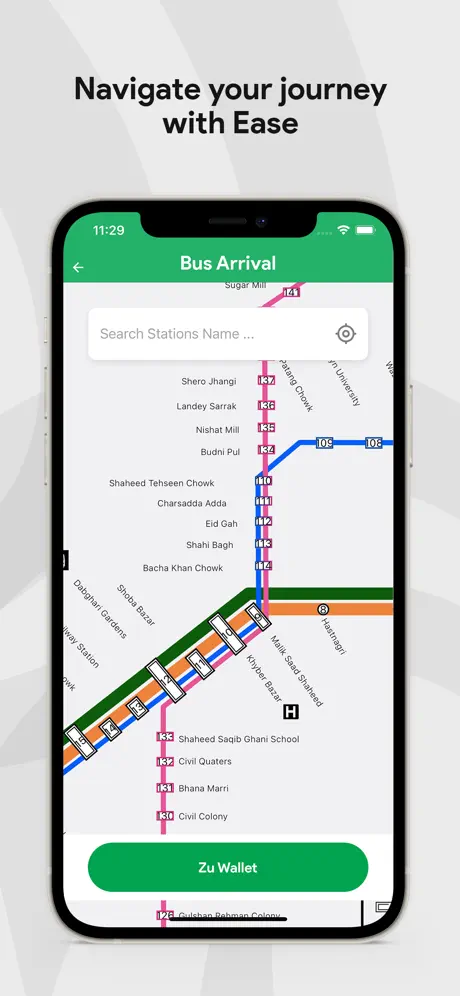
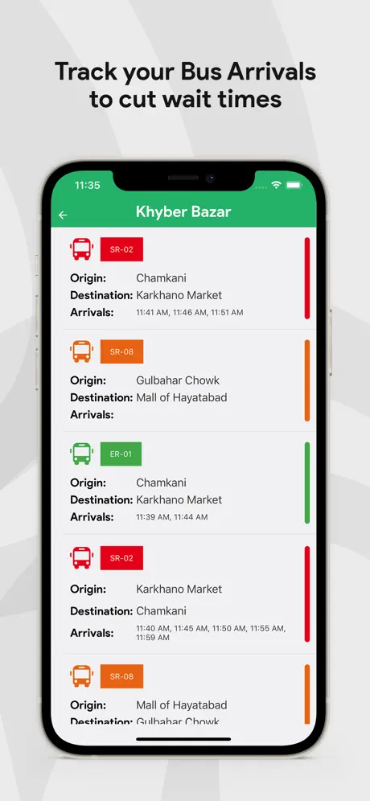
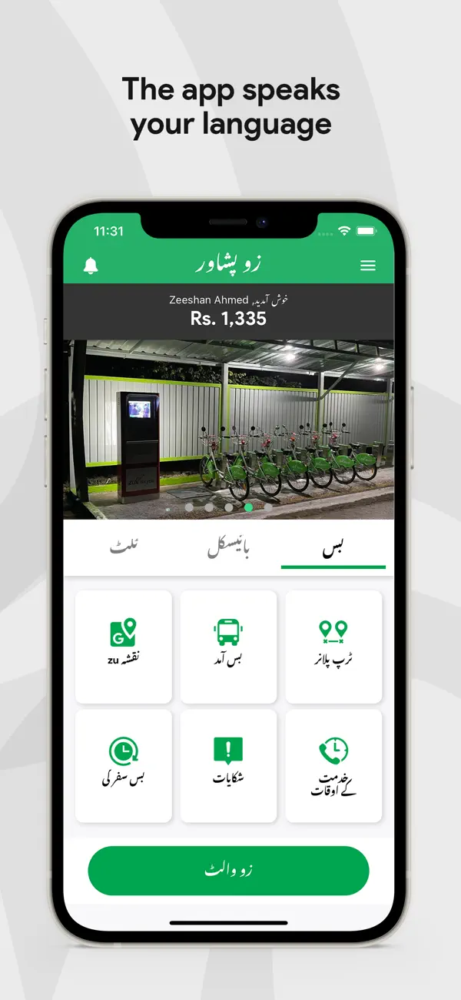
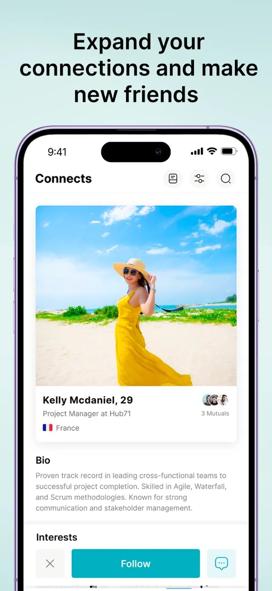
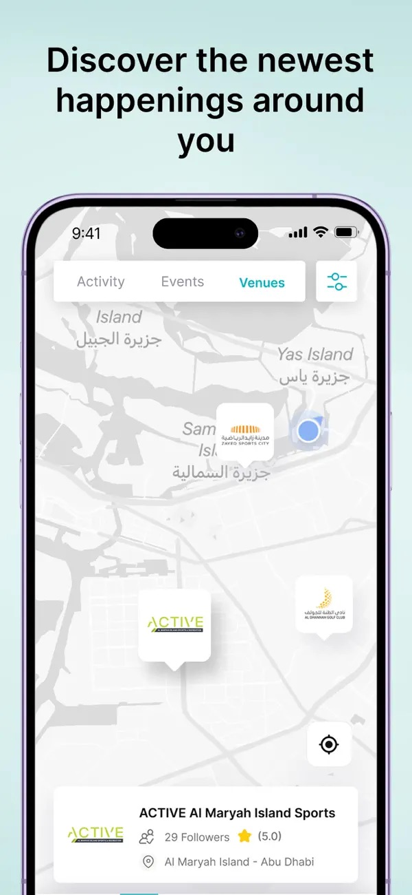
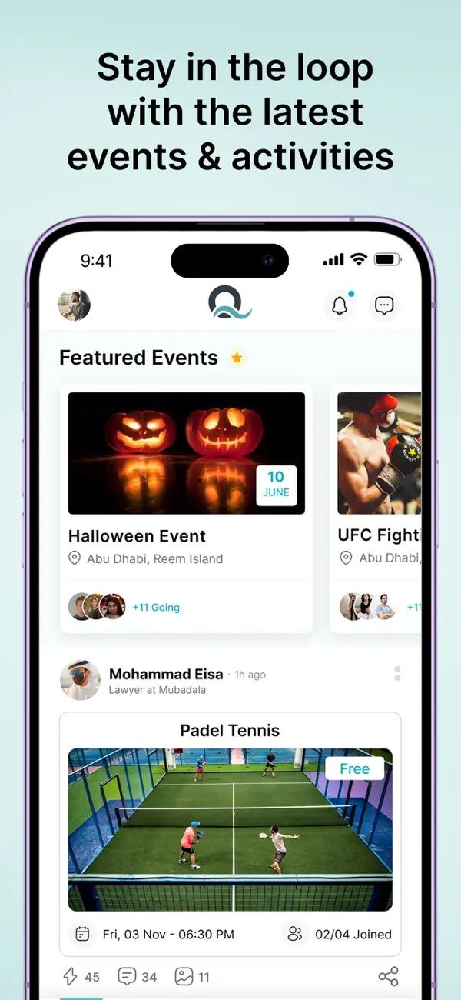
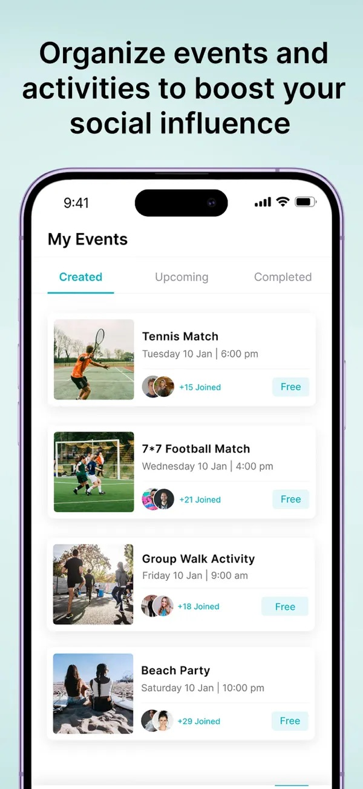
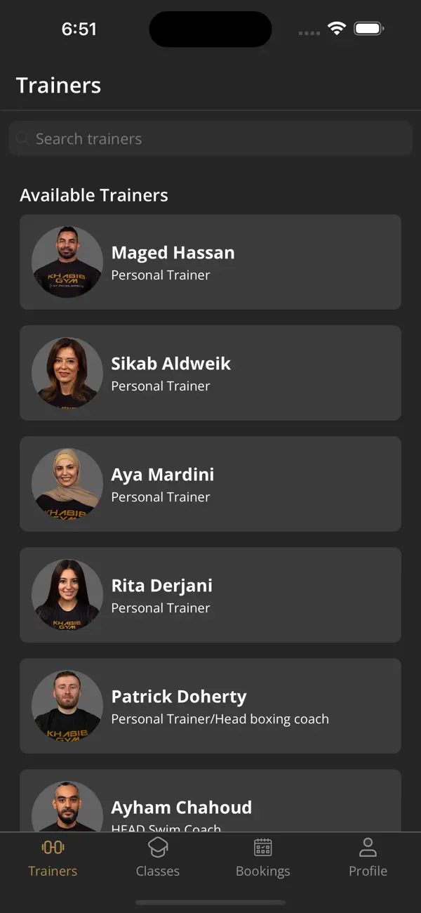
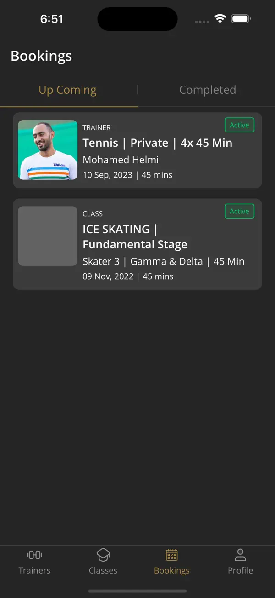
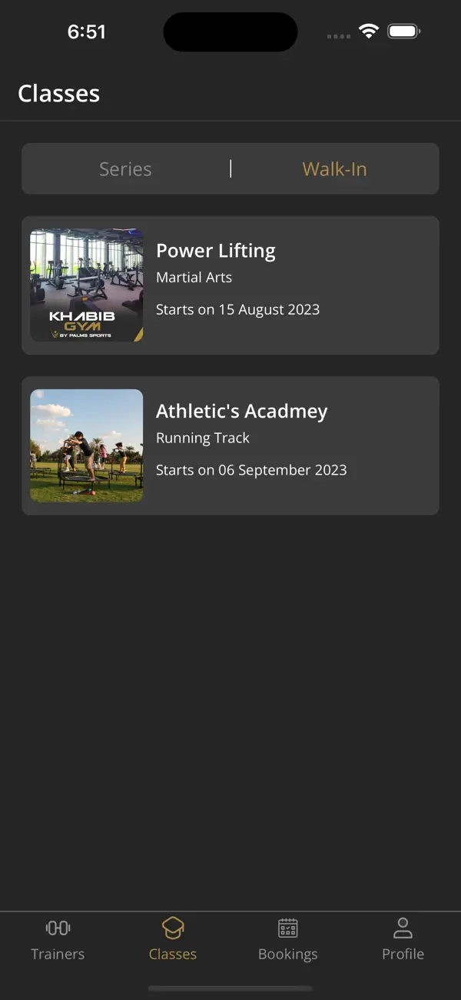

# 📲 **Zeeshan Ahmed – iOS Development Portfolio**  
*"Turning Ideas into Impactful iOS Experiences"*  

Welcome! I’m an expert native iOS developer with **6+ years** of experience delivering scalable, user-centered solutions. From **public transit apps with 600,000+ users** to **sports venue management platforms across the UAE**, I’ve successfully led the development of intuitive, high-performing applications. 

I specialize in **designing, building, and optimizing iOS apps** that meet market demands while delivering delightful user experiences. Below are some of my key projects.

---

# 📱 **Highlighted Projects**

## 🚍 **Zu Peshawar** – A Public Transit App   
[Download on App Store](https://apps.apple.com/ae/app/zu-peshawar/id1532389509)  

The **Zu App** serves as a **virtual bus card** for passengers using the BRT system in Peshawar. With real-time bus tracking and route planning, it ensures smooth public transit experiences.

**🚀 Key Achievements:**  
- Facilitated **100,000+ daily rides** across the BRT system.  
- Rated highly for its **easy-to-use virtual card** feature and **real-time tracking**.  

**✨ Features:**  
- Travel cash-free with a virtual bus card.  
- Plan routes efficiently with real-time navigation.  
- Stay informed with live bus tracking and ETA updates.  

**🔧 Tech Stack:**  
- Swift | UIKit | UserDefaults | Realm  

### Screenshots:  

  
  
  
  

---

## ⚽ **Q App by Qode** – Sports, Social Networking & Event Booking  
[Download on App Store](https://apps.apple.com/ae/app/q-app-by-qode/id1587508672)  

The **Q App** is an all-in-one platform for **sports enthusiasts and social networkers** in the UAE. It makes it easy to **book venues, discover events, and connect with like-minded individuals**.

**🚀 Key Achievements:**  
- Facilitated **25,000+ bookings** across sports venues in just **2 months**.  
- Helped create a vibrant user base by combining **sports and social networking** in one platform.  

**✨ Features:**  
- Book sports venues or participate in sports events.  
- Discover events and buy tickets with ease.  
- Create activities and invite friends to join you.  

**🔧 Tech Stack:**  
- Swift | UIKit | UserDefaults  

### Screenshots:  

  
  
  
  

---

## 🥋 **Khabib Gym** – Training & Events Platform  
[Download on App Store](https://apps.apple.com/ae/app/khabib-gym/id6451473158)  

Developed for **Khabib Gym** in Abu Dhabi, this app helps members **book personal trainers, manage academy enrollments**, and participate in exclusive events hosted by the gym.

**🚀 Key Achievements:**  
- Provided a streamlined solution for **gym members** to book sessions and manage enrollments.  
- Collaborated with **Khabib Nurmagomedov’s team** to deliver a top-tier app experience.  

**✨ Features:**  
- Book personal trainers and manage schedules effortlessly.  
- Enroll in academies and track performance.  
- Participate in gym-hosted events and competitions.  

**🔧 Tech Stack:**  
- Swift | UIKit | UserDefaults  

### Screenshots:  

  
  
  

---

# 🌟 **Skills & Expertise**  
- **Programming Languages:** Swift, Objective-C  
- **Frameworks & Tools:** UIKit, Realm, UserDefaults  
- **Specialties:** Custom Animations, Firebase Analytics, In-app Purchases, API Integrations  
- **Backend Experience:** Google Cloud, Parse SDK  

---

# 💼 **Let's Work Together**  
If you’re looking for a developer who can **turn your idea into reality**, let’s connect! I specialize in creating **feature-rich, user-friendly iOS apps** that help businesses achieve their goals.  

### 📧 **Contact Me:**  
- **Email:** [zeeshan.ahmed0075@gmail.com](mailto:zeeshan.ahmed0075@gmail.com)  
- **LinkedIn:** [Zeeshan Ahmed](https://www.linkedin.com/in/zeeshan-ahmed-se/)  
- **X:** [Zeeshan Ahmed](https://x.com/A_zeeshan0075)