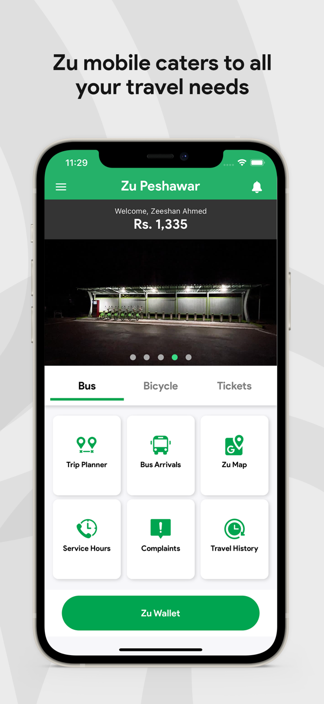

# 📲 **Zeeshan Ahmed – iOS Development Portfolio**  
*"Turning Ideas into Impactful iOS Experiences"*  

Welcome! I’m an expert native iOS developer with **6+ years** of experience delivering scalable, user-centered solutions. From **public transit apps with 600,000+ users** to **sports venue management platforms across the UAE**, I’ve successfully led the development of intuitive, high-performing applications. 

I specialize in **designing, building, and optimizing iOS apps** that meet market demands while delivering delightful user experiences. Below are some of my key projects.

---

# 📱 **Highlighted Projects**

## **Zu Peshawar – A Public Transit App**  
[Download on App Store](https://apps.apple.com/ae/app/zu-peshawar/id1532389509)  

**Overview**: The **Zu App** serves as a **virtual bus card** for passengers using the BRT system in Peshawar. With real-time bus tracking and route planning, it ensures smooth public transit experiences.

### **🚀 Key Achievements**  
- Facilitated **100,000+ daily rides** across the BRT system.  
- Highly rated for its **easy-to-use virtual card** feature and **real-time tracking**.  

### **✨ Features**  
- **Cashless Travel**: Utilize a virtual bus card for seamless payments.  
- **Real-time Navigation**: Efficiently plan routes with up-to-date information.  
- **Live Bus Tracking**: Receive notifications on bus locations and estimated arrival times.  

### **🔧 Tech Stack**  
- **Languages/Frameworks**: Swift | UIKit  
- **Storage**: UserDefaults | Realm | RealmSwift  
- **Networking**: Alamofire | Firebase (Messaging, Auth, Crashlytics, Analytics, RemoteConfig)  
- **User Interface**: XLPagerTabStrip | LGSideMenuController | FloatingPanel | ImageSlideshow  
- **Maps**: GoogleMaps | GooglePlaces  
- **Others**: SDWebImage | PinCodeInputView | QRCode | PromisedFuture | AlamofireNetworkActivityLogger  

### **📈 Skills Utilized**  
- API Integration  
- UI/UX Design Principles  
- Performance Optimization  
- Testing and Debugging  

### **Design Patterns**  
- **Architecture**: MVC  
- **Communication Patterns**: Delegates and Protocols  

### **Screenshots**  

  
  
  
  

---

## **Q App by Qode – Sports, Social Networking & Event Booking**  
[Download on App Store](https://apps.apple.com/ae/app/q-app-by-qode/id1587508672)  

**Overview**: The **Q App** is an all-in-one platform for **sports enthusiasts and social networkers** in the UAE, facilitating easy **venue bookings, event discovery, and social connections**.

### **🚀 Key Achievements**  
- Facilitated **25,000+ bookings** across sports venues in just **2 months**.  
- Cultivated a vibrant user community by merging **sports and social networking** in a single app.  

### **✨ Features**  
- **Venue Booking**: Reserve sports venues or join sports events with ease.  
- **Event Discovery**: Easily find and purchase tickets for upcoming events.  
- **Social Activities**: Create and share activities, inviting friends to join you.  

### **🔧 Tech Stack**  
- **Languages/Frameworks**: Swift | UIKit  
- **Storage**: UserDefaults | RealmSwift  
- **Networking**: Alamofire | Starscream | Firebase (Core, Messaging, Auth, Crashlytics, Analytics, Performance, DynamicLinks, RemoteConfig)  
- **User Interface**: MaterialComponents  
- **Media Handling**: Kingfisher  
- **Maps**: GoogleMaps | GooglePlaces  

### **📈 Skills Utilized**  
- API Integration  
- User Interface Design  
- Data Persistence and Management  
- Testing and Debugging  

### **Design Patterns**  
- **Architecture**: MVVM  
- **Communication Patterns**: Delegates and Protocols  
- **Navigation**: Coordinator Pattern  

### **🔧 Development Practices**  
- **Version Control**: Git  
- **CI/CD**: Fastlane  

### **Screenshots**  

  
  
  
  

---

---

## **Khabib Gym – Training & Events Platform**  
[Download on App Store](https://apps.apple.com/ae/app/khabib-gym/id6451473158)  

**Overview**: Developed for **Khabib Gym** in Abu Dhabi, this app enables members to **book personal trainers, manage academy enrollments**, and engage in exclusive gym-hosted events.

### **🚀 Key Achievements**  
- Provided a streamlined solution for **gym members** to book sessions and manage enrollments efficiently.  
- Collaborated with **Khabib Nurmagomedov’s team** to deliver a top-tier app experience.  

### **✨ Features**  
- **Trainer Booking**: Effortlessly book personal trainers and manage schedules.  
- **Academy Enrollment**: Enroll in academies and track performance metrics.  
- **Event Participation**: Join gym-hosted events and competitions with ease.  

### **🔧 Tech Stack**  
- **Languages/Frameworks**: Swift | UIKit  
- **Networking**: Alamofire | Firebase (Core, Crashlytics, Analytics, Performance, Messaging)  
- **Animation**: Lottie  
- **Storage**: UserDefaults  

### **📈 Skills Utilized**  
- API Integration  
- User Interface Design  
- Data Management and Persistence  
- Performance Optimization  

### **Design Patterns**  
- **Architecture**: MVVM  
- **Communication Patterns**: Delegates and Protocols  
- **Navigation**: Coordinator Pattern  

### **🔧 Development Practices**  
- **Version Control**: Git  
- **CI/CD**: Fastlane  

### **🔍 Other Frameworks**  
- MaterialComponents | Kingfisher  

### **Screenshots**  

  
  
  

---

# 🌟 **Skills & Expertise**  
- **Programming Languages:** Swift, Objective-C  
- **Frameworks & Tools:**  
  - **UI Frameworks:** UIKit, MaterialComponents, Lottie  
  - **Networking & API:** Alamofire, Firebase (Core, Crashlytics, Analytics, Performance, Messaging)  
  - **Data Management:** Realm, UserDefaults  
  - **Animation & UI Enhancements:** JXPageControl, DPOTPView, Kingfisher, FloatingPanel  
- **Integration Skills:** Azure Active Directory, UAE Pass (seamless authentication)  
- **Design Patterns:** MVC, MVVM, Coordinator Pattern  
- **Specialties:** Custom Animations, Firebase Analytics, In-app Purchases, API Integrations, User Interface Design, Performance Optimization  
- **Version Control & CI/CD:** Git, Fastlane  
- **Backend Experience:** Google Cloud, Parse SDK  

---

# 💼 **Let’s Collaborate**  
Are you seeking a dedicated iOS developer to **bring your vision to life**? Let’s connect! I specialize in crafting **feature-rich, intuitive iOS applications** that empower businesses to reach their objectives and engage their users effectively.

### 📧 **Get in Touch:**  
- **Email:** [zeeshan.ahmed0075@gmail.com](mailto:zeeshan.ahmed0075@gmail.com)  
- **LinkedIn:** [Zeeshan Ahmed](https://www.linkedin.com/in/zeeshan-ahmed-se/)  
- **Twitter:** [@A_zeeshan0075](https://x.com/A_zeeshan0075)  

---
